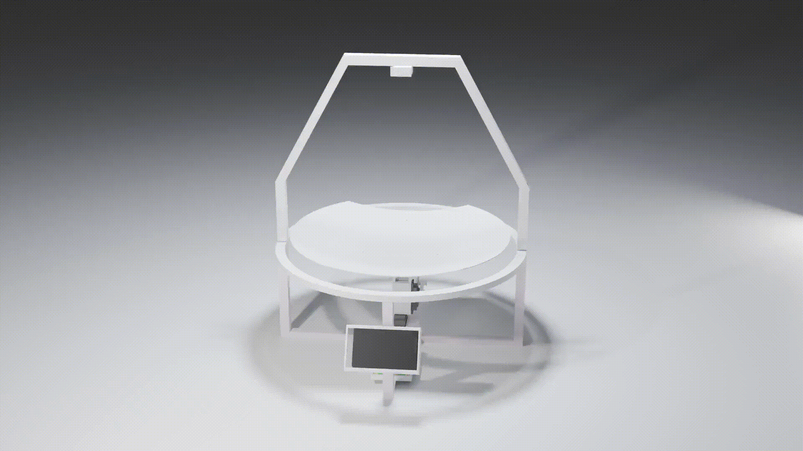

# 🗑️ MISS
**An AI-Powered Multi Item Sorting System**

*A Diploma Thesis by **Fronthaler** and **Glatz***

  

---

## 📝 Overview
MISS (Multi Item Sorting System) is an intelligent waste sorting system designed to automate the process of recycling. By combining computer vision with custom hardware, the system identifies waste types and sorts them accordingly using servos.

## 🚀 Key Features
- **🤖 AI Detection**: Uses YOLO (You Only Look Once) to classify waste in real-time.
- **🖥️ Custom GUI**: A dedicated interface for monitoring camera feeds and system status.
- **⚙️ Hardware Control**: Custom PCB design and servo motor integration for physical sorting.
- **📦 3D Design**: Fully integrated mechanical structure designed for 3D printing.

## 📂 Project Structure
- `3D/`: CAD files, Blender scene, and print-ready STL/3MF files for the physical bin structure.
- `YOLO/`: YOLO model training and detection scripts.
- `capture-photos/`: Scripts for capturing training images from the camera.
- `display-cam-gui/`: Python-based GUI for the system display and camera feed.
- `pcb/`: PCB schematic and layout files for the electronics.
- `servo-test/`: Hardware testing scripts for the sorting mechanisms.
- `Doku-IMG/`: Diagrams and images used in the thesis documentation.

## 🛠️ Tech Stack
- **Languages**: Python
- **AI Framework**: Ultralytics YOLO
- **Hardware**: Custom PCBs, Servo Motors, Raspberry Pi, Camera Module
- **3D Design**: FreeCAD, Blender (for animation renders)

## 📄 Documentation
The complete diploma thesis is included as `Diplomarbeit.docx` in the repository root.

